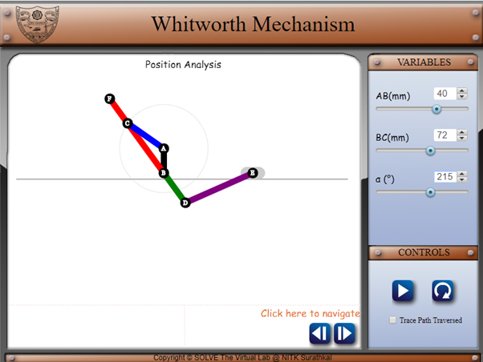
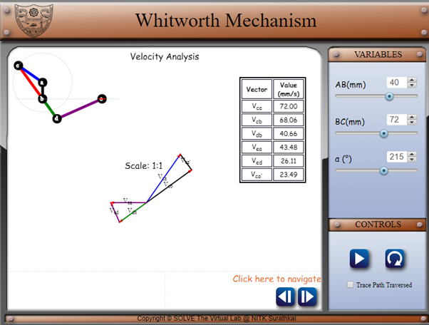
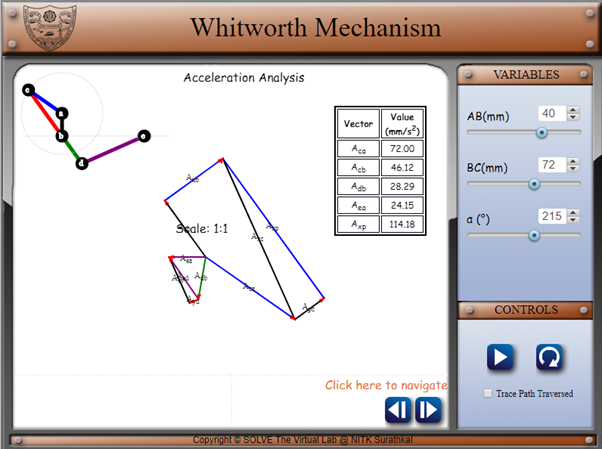

The simulation enables the user to view the working of Whitworth mechanism, and understand the kinematic analysis of the same. The simulation allows the user to change the following parameters-
a.Length of fixed link (AB)
b.Length of slotted link (BC)
c.Angular velocity of crank
d.Angle of crank with horizontal (only in paused state)

Fig 4

To find the velocity of ram (E) at any given position and determine the coriolis component of acceleration.
1. Set the lengths of the fixed link (AB) and the sliding link (BC).
2. Set the input angle to the necessary value.

Fig 5

3. Navigate to the velocity analysis page. Identify the velocity of the ram (Vea).

Fig 6

4.Navigate to the acceleration analysis page. Identify the coriolis component of acceleration (Axp).