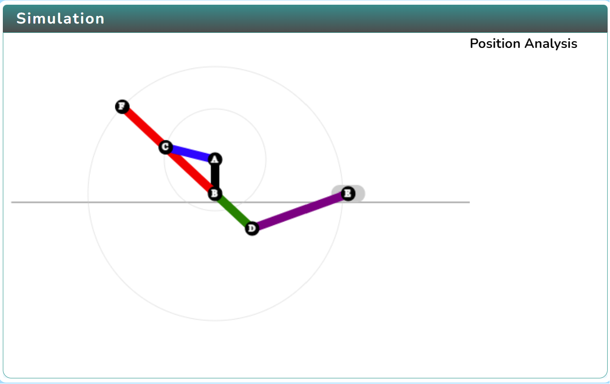
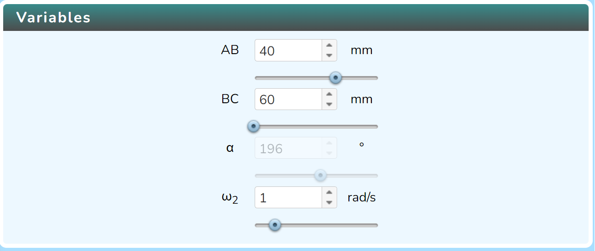
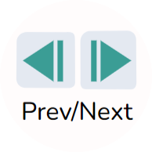
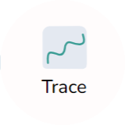

### Procedure

  Click on the Simulation icon      to view the simulation screen. 

   
   
   In order to view the variable section click on the Variable icon. 

   

   Click on Play icon  to run the simulation and click on Pause icon  to stop it.

   Click on the Next or Prev icon  to cycle through different analysis. 

 Click on the Rotate icon   to change the direction of rotation.

 Click on the Trace icon   to trace the path.    
   

