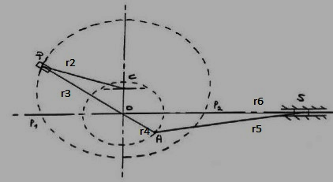
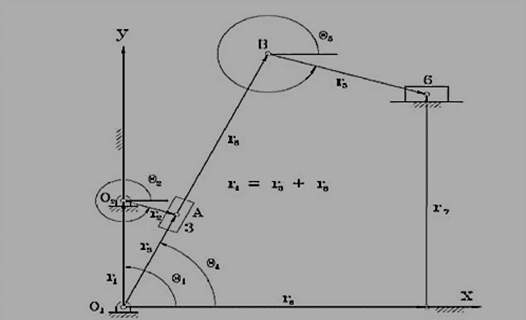
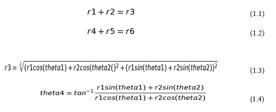
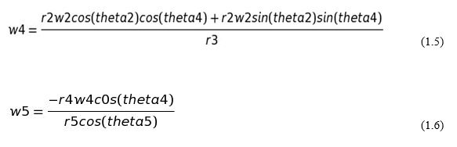
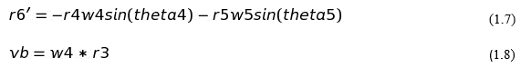
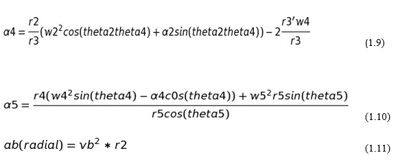
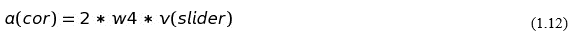
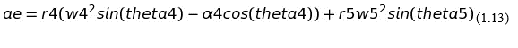

## THEORY

Fig 1

The Whitworth quick return mechanism converts rotary motion into reciprocating motion, but unlike the crank and slider, the forward reciprocating motion is at a different rate than the backward stroke. At the bottom of the drive arm, the peg only has to move through a few degrees to sweep the arm from left to right, but it takes the remainder of the revolution to bring the arm back. This mechanism is most commonly seen as the drive for a shaping machine as shown in.

The link POA rotates about O. The link r2 is the input link and rotates about C at constant angular velocity. The slider P slides along POA. When P is at P1, the slider S is at the outer end. When P is at P2, S is at the nearer end.

Since PC rotates at constant speed, the time taken to go from P1 to P2 is lesser than from P2 to P1. However, the slider S moves the same distance both the times. Therefore the speed of S is different both the times. During the return stroke, the slider S has a larger speed.

Fig 2 Whitworth Mechanism in Shaper

**Mathematical Model**

Fig 3

**Position Analysis**

For the Whitworth Quick Return Mechanism shown in Figure 1, the displacement analysis can be formulated

&nbsp;

Similarly r6 and theta5 is calculated.
&nbsp;

**Velocity Analysis**

Differentiating eq 1.1 and 1.2 with respect to time,

&nbsp;

Velocity of the ram is given by-

&nbsp;

**Acceleration Analysis**

Differentiatin eq 1.5 and 1.6 with respect to time,

&nbsp;

The coriolis component is given by-

Acceleration of the ram is given by-

